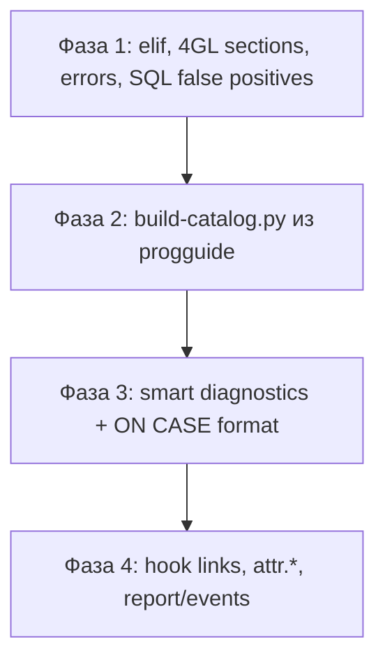

# План улучшений Infor LN 4GL Extension

Документ основан на сравнении текущего расширения **LanBaan** с **Infor ES Programmers Guide v10.8.0** (локальная копия: `ln-progguide/dist/data/progguide`, ~2621 страница).

Цель — не заменить LN Studio / `bic`, а сделать VS Code/Cursor удобным редактором для скриптов, скопированных из Tools или открытых по Remote-SSH.

---

## Текущее покрытие vs документация

| Область | Сейчас | В Progguide | Покрытие |
|---|---:|---:|---|
| API-функции (`completions.functions`) | 81 | ~2000 | ~4% |
| Hover / docs (`data/docs.json`) | 96 | ~2000+ | ~5% |
| Signature help (`data/signatures.json`) | 40 | ~2000 | ~2% |
| 4GL-секции (completion) | 15 | ~45+ | ~33% |
| DAL-хуки | 15 | ~56 | ~27% |
| Коды ошибок | 8 | 79 | ~10% |
| Ключевые слова | 59 | 78+ | ~75% |

### Уже реализовано хорошо

- Подсветка синтаксиса (TextMate grammar из Vim `baan.vim`)
- Контекстный completion (SQL / секции / general)
- Outline и Go to Definition (функции в файле, `#include`)
- Find References / Rename (текущий файл)
- Hover и signature help (частичный каталог)
- Диагностика блоков (`if`/`endif`, `select`/`endselect`, …)
- Quick Fix для `for … by` → `step` и лишнего `while … do`
- Format Document (только отступы, без trim trailing spaces)
- Folding (секции 4GL, control blocks, `{}`)

### Известные ограничения (сохраняем)

- Нет связи с LN Studio, BW, `bic`
- Нет check-out / compile / type-check по доменам и таблицам
- Go to Definition / References — только текущий файл (+ `#include`)
- Форматирование — indent-only

---

## Источники в Progguide

| Раздел | Путь | Содержание |
|---|---|---|
| 3GL Language | `pages/3gl_features/` | 50 страниц: vocabulary, control flow, iterations, preprocessor |
| 4GL Language | `pages/4gl_features/` | 16 страниц: field/form/choice/group/main.table/zoom sections |
| DAL | `pages/functions_dal/` | ~56 object/field hooks |
| Runtime API | `pages/functions_*/` | ~2000 функций в 97 папках |
| Ошибки runtime | `pages/errors/` | 79 кодов (100–850) |
| SQL states | `pages/sql_states_and_messages/` | 108 кодов |
| Events | `pages/events/` | Event API |
| Report scripts | `pages/report_scripts/` | Секции отчётов |
| Predefined vars | `pages/misc/predefined_variables.json` | `attr.*` в 4GL |

Структура страницы функции (пригодна для автогенерации):

- `title` — имя (`before.save.object()`)
- `sections[]` — Syntax, Description, Arguments, Context, Return value, Example
- `bodyHtml` — HTML с сигнатурами и таблицами аргументов
- `related[]` — перекрёстные ссылки (hook ↔ API)

---

## Фаза 1 — быстрые победы (1–2 дня)

### 1.1 Языковые конструкции 3GL

| Задача | Источник | Файлы |
|---|---|---|
| Добавить **`elif`** в keywords, grammar, completions, block-pairs (`if` middle) | `the_if_then_else_statement.json` (TIV 2330+) | `keywords.js`, `build-grammar.py`, `completions.json` |
| Hover для **`on case`**, **`default`**, **`break`**, **`continue`** | `the_on_case_statement.json`, `iterations.json` | `docs.json` |
| Исправить ложный **`else outside if`** в SQL `CASE … ELSE … ENDCASE` | SQL CASE vs 3GL ON CASE | `blocks.js`, `keywords.js` |
| Не считать SQL **`ENDCASE`** закрытием 3GL **`on case`** без opener | `functions_database_handling/simple_case.json` | `blocks.js` |

**Статус ON CASE (исправлено):** opener блока — только `on case`, не `case expr:`. Внутренние метки `case 2:`, `case 3:`, `default:` — labels, не openers.

### 1.2 Расширить 4GL-секции

Источник: `4gl_features/4gl_*_sections.json`.

Добавить в `completions.json` → `sections` и `docs.json`:

**Form:** `init.form:`, `before.form:`, `after.form:`

**Group:** `init.group:`, `before.group:`, `after.group:`

**Choice:** `before.choice:`, `on.choice:`, `after.choice:`

**Main table I/O:** `before.read:`, `after.read:`, `before.write:`, `after.write:`, `before.delete:`, `after.delete:`, …

**Zoom:** `on.entry:`, `on.exit:`

**Field (если отсутствуют в completion):** `before.checks:`, `domain.error:`, `ref.input:`, `ref.display:`, `after.zoom:`

Сниппеты (по аналогии с `fld` / `chc`): `form`, `group`, `maintable`, `zoom`.

Outline (`parse.js`) уже знает многие из этих секций — синхронизировать completion с parser.

### 1.3 Коды ошибок runtime

Источник: `pages/errors/*.json` (79 штук).

Расширить `completions.errors` и `docs.json`:

- `ESQLQUERY`, `EPERMISSION`, `EAUDABORT`, `EABORT`, `EFULL`, `ESECURITY`, …
- Hover: краткое описание из `title` страницы, напр. `"850 EABORT — Transaction aborted"`

Тест: `catalog.test.js` — docs для каждого error code.

### 1.4 Preprocessor

Grammar уже подсвечивает `#elif`. Добавить в completion и snippets:

- `#include`, `#define`, `#undef`, `#ifdef`, `#ifndef`, `#elif`, `#endif`, `#pragma`, `#ident`
- Сниппет include-guard (`ifndef` / `endif`)

---

## Фаза 2 — генератор каталога из Progguide (3–5 дней)

**Наибольший ROI:** один скрипт даёт прыжок с 81 до ~2000 функций.

### 2.1 `scripts/build-catalog.py`

По аналогии с `scripts/build-grammar.py`:

```
progguide/pages/functions_*/*.json
    → data/completions.json   (functions, dalHooks, constants)
    → data/docs.json          (краткий hover)
    → data/signatures.json    (syntax из bodyHtml)
    → data/links.json         (optional: related[] для навигации)
```

Из каждой страницы функции извлекать:

| Поле guide | Назначение в extension |
|---|---|
| `title` | Имя функции (`dal.save.object`) |
| Syntax (`bodyHtml`) | `signatures.json` |
| Description (1-й абзац) | `docs.json` hover |
| Context | Тег: `4GL` / `DAL` / `3GL` / `all` |
| Return value | Hover + completion detail |
| `related[]` | Связи hook ↔ API |

CI: `npm run check:catalog` — fail если committed artifacts drift (как `check:grammar`).

Путь к progguide — **локальная настройка разработчика**, не коммитить исходный guide в репозиторий.

### 2.2 Контекстный completion

Расширить `detectContext()` в `completion.js`:

| Контекст | Что предлагать в первую очередь |
|---|---|
| UI-скрипт (есть `field.` / `choice.`) | 4GL-секции, `execute`, `display`, `attr.*` |
| DAL (есть `before.save.object` и т.п.) | DAL-хуки, `dal.*`, `DALHOOKERROR` |
| 3GL `function main` | `db.*`, `select`, preprocessor |
| Внутри `select…selectdo` | SQL keywords |

Фильтр по полю **Context** из guide.

### 2.3 Полный каталог DAL-хуков

Источник: `functions_dal/` (~56 файлов).

Object hooks: `before.save.object`, `after.save.object`, `before.new.object`, `before.get.object`, …

Field hooks: `field.update`, `field.is.mandatory`, `fieldname.check`, …

Hover с пометками замены UI-секций:

- `before.save.object` **заменяет** `before.write` / `before.rewrite` в main.table.io
- `field.update` **заменяет** часть `when.field.changes`

---

## Фаза 3 — диагностика и форматирование (1–2 недели)

### 3.1 Новые диагностики

| Правило | Severity | Источник |
|---|---|---|
| `for … by` → use `step` | warning | уже есть |
| `while … do` | warning | уже есть |
| `long` как условие IF (deprecated) | warning | `the_if_then_else_statement.json` |
| Дублирующиеся `CASE expr` в одном `ON CASE` | warning | `the_on_case_statement.json` |
| Незакрытые `dllusage` / `functionusage` | error | `vocabulary.json` |
| `before.write:` при наличии DAL в проекте | info/warning | `before.save.object.json` |

### 3.2 Форматирование `ON CASE`

В `format.js` — отдельная логика отступов:

```
on case expr          ← base
    case 1:           ← base + 1
        statements    ← base + 2
        break
    default:          ← base + 1
        statements    ← base + 2
endcase               ← base
```

Поддержать fall-through (несколько `case N:` подряд без тела) — как в `long_expressions_on_case.json`.

### 3.3 Folding для `on case`

Добавить `on case` в `language-configuration.json` folding markers (start), если ещё не добавлено.

---

## Фаза 4 — навигация и UX (2+ недели)

### 4.1 Связанные хуки (Document Links)

Из `related[]` и `data-internal` в JSON guide:

- `dal.save.object` → документация / `before.save.object`
- `before.write:` (UI) → подсказка «см. before.save.object в DAL»

Реализация: `DocumentLinkProvider` + `data/links.json` из `build-catalog.py`.

### 4.2 `attr.*` predefined variables

Источник: `misc/predefined_variables.json`.

Completion + hover: `attr.changed`, `attr.input`, `attr.zoom`, … — часто в UI-скриптах.

### 4.3 Report scripts

Источник: `report_scripts/`.

Секции и сниппеты для report `.bc` (дополнить существующий `rpt`).

### 4.4 Events API

Источник: `events/` + функции `send.event`, `next.event`, `peek.event`.

Completion для event-типов и констант.

### 4.5 SQL states (опционально)

Источник: `sql_states_and_messages/` (108 кодов).

Hover при встрече `42I57`, `42T01` в комментариях или строках логов — низкий приоритет.

---

## Фаза 5 — осознанные границы

| Идея | Почему не в scope |
|---|---|
| Проверка доменов / table.field по DD | Нужен экспорт Data Dictionary с сервера |
| Интеграция с `bic` / compile | Серверная операция, не редактор |
| Cross-file symbol index | Отдельная архитектура (LSP workspace symbols) |
| Completion имён полей формы | Имена из DFE, не из Progguide |
| Table.field по метаданным LN | Runtime dictionary API есть, DD — нет |

---

## Порядок реализации



### Рекомендуемый первый PR

1. `build-catalog.py` (MVP: functions + dalHooks + docs + signatures)
2. `elif` в language support
3. Расширение 4GL-секций в completion/docs
4. 79 error codes
5. Тесты на боевые паттерны: `on case`, `elif`, SQL `CASE`

---

## Лицензия и данные

- **Infor ES Programmers Guide** — материал Infor Customer Portal (KB2924522), не публичный.
- В git коммитить только **сгенерированные** JSON (`data/completions.json`, `data/docs.json`, …), не HTML guide.
- В README указать: «keyword/API inventory partially derived from Infor ES Programmers Guide».
- Скрипт `build-catalog.py` принимает путь к guide через env или аргумент CLI.

---

## Чеклист для проверки после каждой фазы

- [ ] `npm test` — unit tests pass
- [ ] `npm run test:grammar` — fixtures pass
- [ ] `npm run ci` — full pipeline
- [ ] Ручная проверка на `examples/*.bc` и боевом фрагменте с `on case`
- [ ] Extension Development Host (F5) — completion, hover, diagnostics
- [ ] Нет регрессии: `for update`, `#endif` vs `endif`, strings с `|`

---

## Связанные документы

- [language.md](language.md) — 3GL vs 4GL, DAL vs UI sections
- [development.md](development.md) — debug, scripts, grammar regeneration
- [troubleshooting.md](troubleshooting.md) — конфликты расширений, trim whitespace
